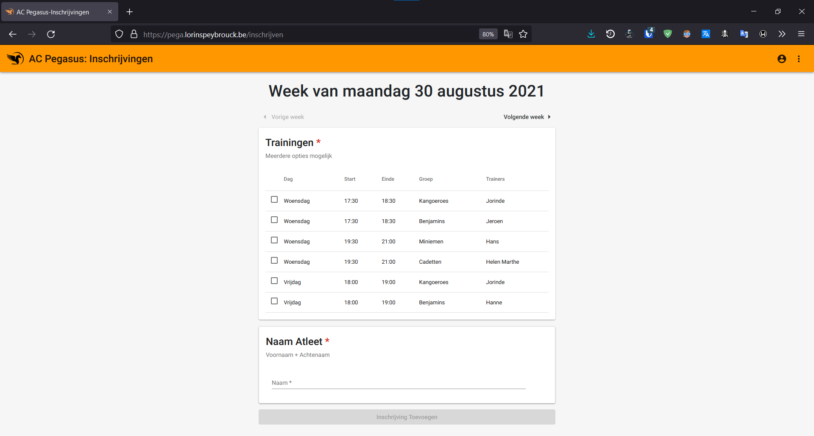
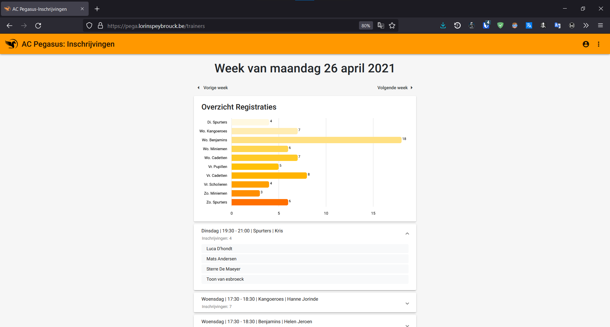
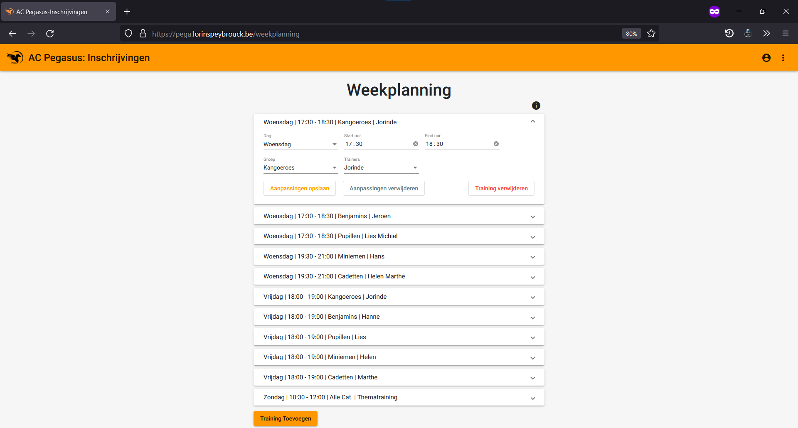

# Pegasus Training Web App

This repo contains:
- A .NET Web API
- A Angular front end in the [/client](client) directory

## Changelog
[Link to changelog](./pegasus/client/src/assets/changelog.md)

## Screenshots

